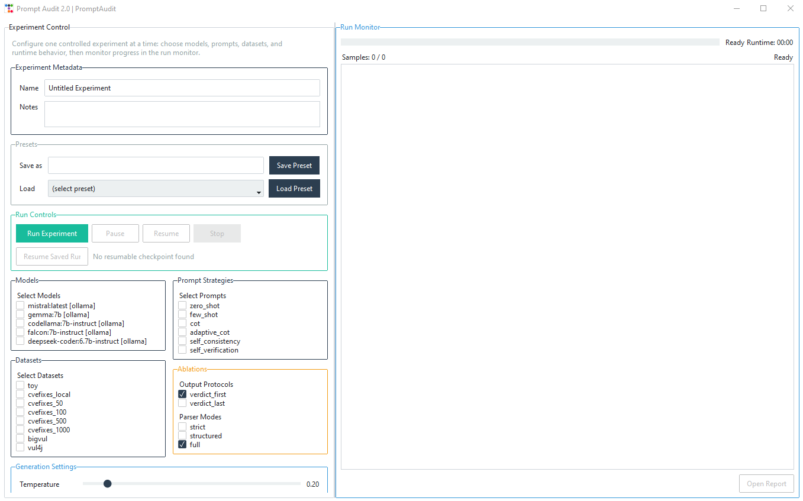
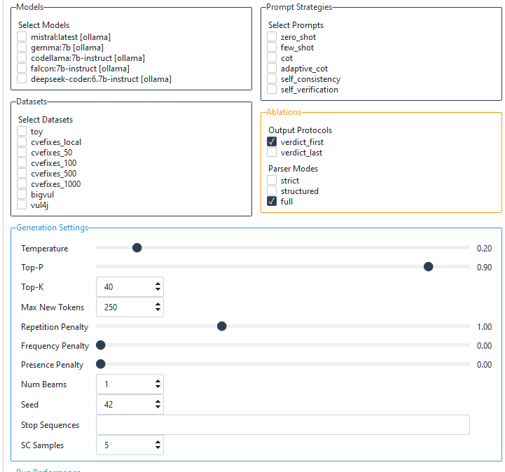
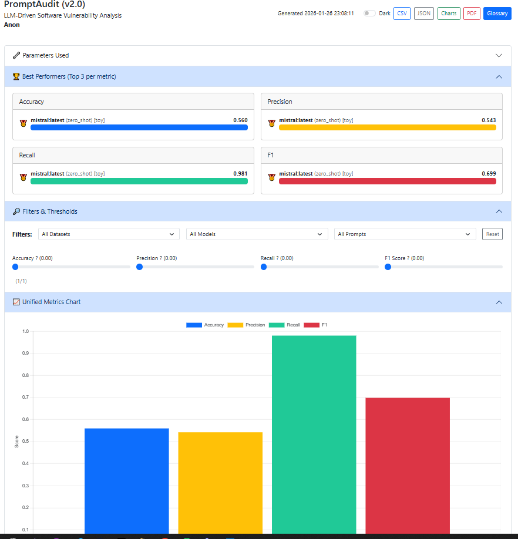

# 🔍 PromptAudit — A Prompt Engineered Framework for AI-Driven Vulnerability Detection
**Author:** Anon -
**Version:** v2.0 (Research Release)

---

## 🚀 Overview
**PromptAudit** is an end-to-end research platform for evaluating how prompt engineering techniques influence the ability of **large language models (LLMs)** to classify source code as **SAFE** or **VULNERABLE**.

It provides:

- A polished **GUI (ttkbootstrap style)**  
- Multi-model support (Ollama, HF Transformers, API)  
- Modular prompt strategies (Zero-Shot, Few-Shot, CoT, Adaptive CoT, Self‑Consistency)  
- Datasets from HuggingFace + local CSV  
- A full **interactive HTML report** (filters, sliders, charts, leaderboard, exports)

This platform is designed for **academic reproducibility**, **benchmarking**, and **prompt-engineering research** in secure software analysis.

---

## 🧩 System Pipeline

```
GUI (dashboard.py)
      │
      ▼
ExperimentRunner (core/runner.py)
      │
      ├── Dataset Loader (code_datasets/)
      ├── Prompt Strategy (prompts/)
      ├── Model Loader (models/)
      └── Metrics + HTML Report (evaluation/)
```
You select:
- Model
- Prompt technique
- Dataset

PromptAudit automatically:
- Builds prompts
- Sends them to the selected model
- Parses the model output
- Computes metrics
- Generates a multi-section interactive report

---

## 📸 Interface Overview

**Figure 1 — Main Dashboard**  


**Figure 2 — Generation Settings**  


**Figure 3 — Sample HTML Report Output**  


---

## 🛠 System Requirements

| Component       | Minimum               | Recommended                                         |
|-----------------|-----------------------|-----------------------------------------------------|
| RAM             | **8 GB**              | **16–32 GB** (Gemma, Mistral, Falcon)               |
| CPU             | Any modern quad‑core  | 8‑core+ for faster evaluation                       |
| GPU             | Optional              | **CUDA GPU** strongly recommended for HF models     |
| Disk Space      | 10 GB                 | 30 GB+ (for models & datasets)                      |

**RAM Notes for Ollama Models:**
Recommended 24GB+ RAM
- `mistral` 🔹 ~8-9 GB RAM  
- `gemma:7b` 🔹 ~7-8 GB RAM  
- `codellama:7b-instruct` 🔹 10-11 GB RAM
- `deepseek-coder:6.7b-instruct` 🔹 7-8 GB RAM    
- `falcon:7b-instruct` 🔹 12-13 GB RAM  

If memory is insufficient, Ollama returns:  
```bat
Error: model requires more system memory than is available
```

---

## 💻 Installation Guide (Windows 10/11)

### 1️⃣ Install Python 3.11+
Download from: https://www.python.org/downloads  
✔ Check: **“Add Python to PATH.”**

---

### 2️⃣ Create & Activate a Virtual Environment

Create Environment:
```bat
python -m venv venv
```
Activate it:
```bat
venv\Scripts\activate
```

For macOS/Linux:
```bat
source venv/bin/activate
```

Make sure your IDE (PyCharm, VSCode) also points to this **same venv**.

---

### 3️⃣ Install Requirements

```bat
pip install -r requirements.txt
```

---

### 4️⃣ Install Ollama

Download: https://ollama.com/download


After installing, open terminal and run:

```bat
ollama serve
```

Then pull one or more models:

```bat
ollama pull mistral:latest
ollama pull gemma:7b
ollama pull codellama:7b-instruct
ollama pull deepseek-coder:6.7b-instruct
ollama pull falcon:7b-instruct
```

---

### 5️⃣ HuggingFace Login (only for HF datasets)

```bat
huggingface-cli login
```

Input your access token. (Check your account profile to create one, readme only)

---

### 6️⃣ Launch the run_PromptAudit

```
python run_PromptAudit.py
```

---

🖥️ **Using the Interface**

| Area                 | Function |
|----------------------|----------|
| Experiment Info      | Add experiment name and notes (for reports). |
| Models               | Choose installed Ollama models. |
| Prompt Strategy      | Choose the prompting method (Zero-Shot, Few-Shot, CoT, Adaptive CoT, Self-Consistency). |
| Dataset Selector     | Pick datasets (Toy, CVEFixes, BigVul, Vul4J). |
| Generation Settings  | Adjust temperature, max new tokens, top-p, repetition penalty, etc. |
| Run Experiment       | Starts evaluation → live progress updates. |
| Run Panel            | Progress, ETA, live logs (some features not implemented yet). |
| Results Access       | Open interactive HTML report. |

---

## 📊 Research Output
Generated files:

| File                        | Description                                               |
|-----------------------------|-----------------------------------------------------------|
| `results/report.html`       | Interactive dashboard with filters, leaderboards, charts  |
| `results/csv/metrics.csv`   | Summary metrics                                           |
| `results/logs/*.log`        | Reproducibility logs                                      |
| `results/*.json`            | Raw outputs (optional)                                    |

---

## 🗂 Project Structure

```
PromptAudit/
│
├── run_PromptAudit.py         # GUI launcher
├── run.bat                    # Windows start script
├── run.sh                     # Linux start script
├── config.yaml                # Models, datasets, generation defaults
├── requirements.txt           # Python dependencies
├── README.md                  # Project documentation
│
├── code_datasets/
│   ├── dataset_loader.py      # Unified loader for local + HF datasets
│   ├── toy_dataset.py         # Local toy dataset loader
│   └── hf_loader.py           # Hugging Face dataset utilities
|
├── core/
│   └── runner.py              # Experiment orchestration engine
│
├── data/
│   └── toy.csv                # Small built-in dataset
|
├── debug/
│   └── files.py...            # Test files for debugging
│
├── docs/
│   └── screenshots/...        # README images
|
├── evaluation/
|   ├── label_parser.py        # Handles the model output responses
│   ├── metrics.py             # TP/TN/FP/FN + Accuracy/Precision/Recall/F1
│   └── report.py              # Full interactive HTML report generator
|
├── models/
│   ├── model_loader.py        # Backend selection (Ollama, Dummy, API)
│   ├── ollama_model.py        # Local Ollama model wrapper
│   ├── api_model.py           # OpenAI-style REST API backend
│   └── dummy_model.py         # Offline deterministic baseline
│
├── prompts/
│   ├── base_prompt.py         # Core prompt interface
│   ├── zero_shot.py           # Zero-shot baseline prompt
│   ├── few_shot.py            # Few-shot example prompting
│   ├── cot.py                 # Chain-of-Thought prompting
│   ├── adaptive_cot.py        # Two-phase CoT fallback logic
│   ├── self_consistency.py    # Majority-vote CoT sampling
│   └── prompt_loader.py       # Prompt strategy registry
|
├── results/
│   ├── csv/                   # Generated CSV summaries
│   ├── logs/                  # Per-run logs
│   └── report.html            # Generated dashboard
│
├── ui/
│   ├── dashboard.py           # Full GUI (ttkbootstrap)
│   └── user_prefs.yaml        # Saved selections & settings
│
└── utils/
    └── io.py                  # Directory creation utilities
```

---

## ▶️ Quick Demo Expirement

1. Launch run_PromptAudit.py  
2. Select:
   - Model: mistral:latest
   - Prompt: zero_shot 
   - Dataset: toy
3. Keep token generation settings defaulted 
4. Add experiment name + notes  
5. Click **Run Experiment**  
6. Wait until the progress bar finishes  
7. Open:  
   ```
   results/report.html
   ```

---

## 🧠 Reproducibility

PromptAudit automatically records:
- Model name & version
- Prompt strategy
- Generation parameters
- Dataset name & timestamp
- Experiment name & notes
- Per-sample predictions

The HTML report includes everything needed for citation and reproducibility.

---

## 🧩 Troubleshooting

| Symptom                           | Cause                             | Fix                                           |
|-----------------------------------|-----------------------------------|-----------------------------------------------|
| ❌ *No Ollama models detected*    | Server not running                | Run `ollama serve`                            |
| ❌ *500: insufficient memory*     | Model too large                   | Use smaller model (e.g., `mistral:latest`)    |
| ❌ *HF dataset unavailable*       | Not logged in                     | Run `huggingface-cli login`                   |
| 🧊 *Progress bar frozen*          | Large model latency               | Normal — wait                                 |
| 📄 *No report generated*          | Experiment was stopped early      | Re‑run                                        |

---

## 📘 Citation (Suggested)

```
ANON.
```
---

🧊 **Built With**

- 🐍 Python 3.11+
- 🎨 ttkbootstrap (UI framework)
- 🤗 Transformers + Datasets
- 🧮 Ollama (local LLMs)
- 📊 Interactive HTML Reports

---


© 2025 Anon — All Rights Reserved.
