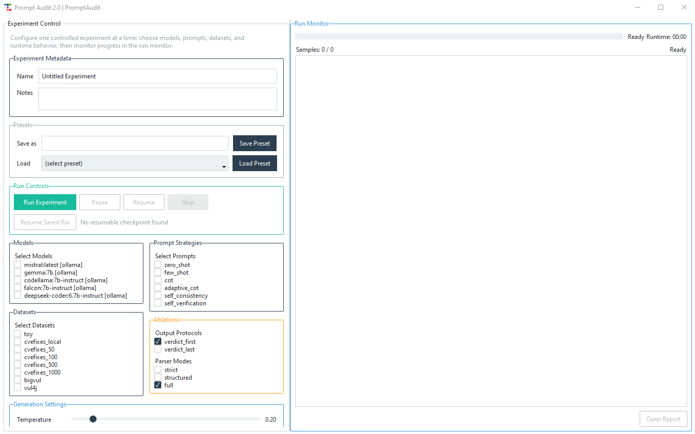
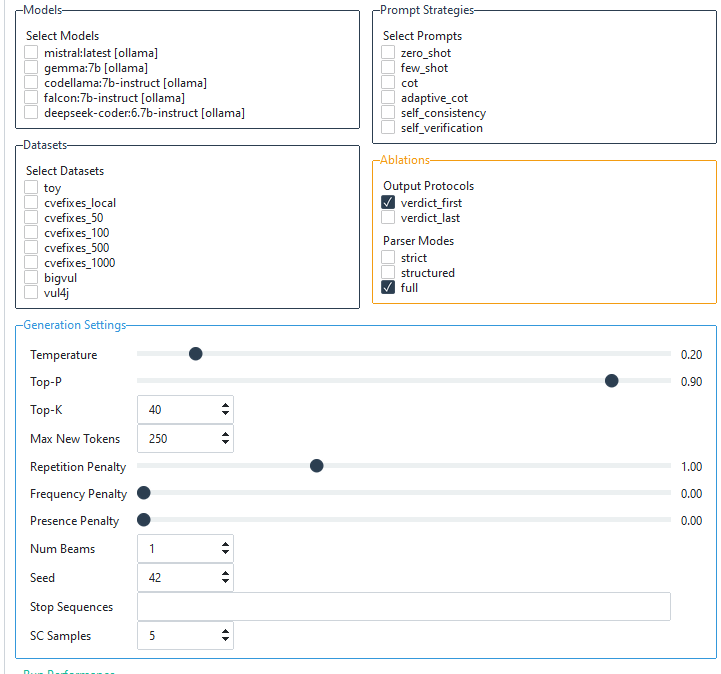
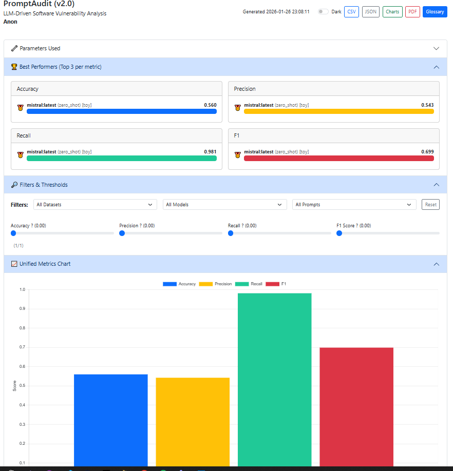

<<<<<<< Updated upstream
# 🔍 PromptAudit — A Prompt Engineered Framework for AI-Driven Vulnerability Detection
**Author:** Steffen Camarato — University of Central Florida  
**Version:** v2.0 (Research Release)

---

## 🚀 Overview
**PromptAudit** is an end-to-end research platform for evaluating how prompt engineering techniques influence the ability of **large language models (LLMs)** to classify source code as **SAFE** or **VULNERABLE**.

It provides:

- A polished **GUI (ttkbootstrap style)**  
- Multi-model support (Ollama, HF Transformers, API)  
- Modular prompt strategies (Zero-Shot, Few-Shot, CoT, Adaptive CoT, Self‑Consistency)  
- Datasets from HuggingFace + local CSV  
- A full **interactive HTML report** (filters, sliders, charts, leaderboard, exports)

This platform is designed for **academic reproducibility**, **benchmarking**, and **prompt-engineering research** in secure software analysis.

---

## 🧩 System Pipeline

```
GUI (dashboard.py)
      │
      ▼
ExperimentRunner (core/runner.py)
      │
      ├── Dataset Loader (code_datasets/)
      ├── Prompt Strategy (prompts/)
      ├── Model Loader (models/)
      └── Metrics + HTML Report (evaluation/)
```
You select:
- Model
- Prompt technique
- Dataset

PromptAudit automatically:
- Builds prompts
- Sends them to the selected model
- Parses the model output
- Computes metrics
- Generates a multi-section interactive report

---

## 📸 Interface Overview

**Figure 1 — Main Dashboard**  


**Figure 2 — Generation Settings**  


**Figure 3 — Sample HTML Report Output**  


---

## 🛠 System Requirements

| Component       | Minimum               | Recommended                                         |
|-----------------|-----------------------|-----------------------------------------------------|
| RAM             | **8 GB**              | **16–32 GB** (Gemma, Mistral, Falcon)               |
| CPU             | Any modern quad‑core  | 8‑core+ for faster evaluation                       |
| GPU             | Optional              | **CUDA GPU** strongly recommended for HF models     |
| Disk Space      | 10 GB                 | 30 GB+ (for models & datasets)                      |

**RAM Notes for Ollama Models:**
Recommended 24GB+ RAM
- `mistral` 🔹 ~8-9 GB RAM  
- `gemma:7b` 🔹 ~7-8 GB RAM  
- `codellama:7b-instruct` 🔹 10-11 GB RAM
- `deepseek-coder:6.7b-instruct` 🔹 7-8 GB RAM    
- `falcon:7b-instruct` 🔹 12-13 GB RAM  

If memory is insufficient, Ollama returns:  
```bat
Error: model requires more system memory than is available
```

---

## 💻 Installation Guide (Windows 10/11)

### 1️⃣ Install Python 3.11+
Download from: https://www.python.org/downloads  
✔ Check: **“Add Python to PATH.”**

---

### 2️⃣ Create & Activate a Virtual Environment

Create Environment:
```bat
python -m venv venv
```
Activate it:
```bat
venv\Scripts\activate
```

For macOS/Linux:
```bat
source venv/bin/activate
```

Make sure your IDE (PyCharm, VSCode) also points to this **same venv**.

---

### 3️⃣ Install Requirements

```bat
pip install -r requirements.txt
```

---

### 4️⃣ Install Ollama

Download: https://ollama.com/download


After installing, open terminal and run (if ollama is running skip this step as it will indicate this port is being used): 

```bat
ollama serve
```

Then pull one or more models:

```bat
ollama pull mistral:latest
ollama pull gemma:7b
ollama pull codellama:7b-instruct
ollama pull deepseek-coder:6.7b-instruct
ollama pull falcon:7b-instruct
```

---

### 5️⃣ HuggingFace Login (only for HF datasets)

```bat
huggingface-cli login
```

Input your access token. (Check your account profile to create one, readme only)

---

### 6️⃣ Launch the run_PromptAudit

```
python run_PromptAudit.py
```

---

🖥️ **Using the Interface**

| Area                 | Function |
|----------------------|----------|
| Experiment Info      | Add experiment name and notes (for reports). |
| Models               | Choose installed Ollama models. |
| Prompt Strategy      | Choose the prompting method (Zero-Shot, Few-Shot, CoT, Adaptive CoT, Self-Consistency). |
| Dataset Selector     | Pick datasets (Toy, CVEFixes, BigVul, Vul4J). |
| Generation Settings  | Adjust temperature, max new tokens, top-p, repetition penalty, etc. |
| Run Experiment       | Starts evaluation → live progress updates. |
| Run Panel            | Progress, ETA, live logs (some features not implemented yet). |
| Results Access       | Open interactive HTML report. |

---

## 📊 Research Output
Generated files:

| File                        | Description                                               |
|-----------------------------|-----------------------------------------------------------|
| `results/report.html`       | Interactive dashboard with filters, leaderboards, charts  |
| `results/csv/metrics.csv`   | Summary metrics                                           |
| `results/logs/*.log`        | Reproducibility logs                                      |
| `results/*.json`            | Raw outputs (optional)                                    |

---

## 🗂 Project Structure

```
PromptAudit/
│
├── run_PromptAudit.py         # GUI launcher
├── run.bat                    # Windows start script
├── run.sh                     # Linux start script
├── config.yaml                # Models, datasets, generation defaults
├── requirements.txt           # Python dependencies
├── README.md                  # Project documentation
│
├── code_datasets/
│   ├── dataset_loader.py      # Unified loader for local + HF datasets
│   ├── toy_dataset.py         # Local toy dataset loader
│   └── hf_loader.py           # Hugging Face dataset utilities
|
├── core/
│   └── runner.py              # Experiment orchestration engine
│
├── data/
│   └── toy.csv                # Small built-in dataset
|
├── debug/
│   └── files.py...            # Test files for debugging
│
├── docs/
│   └── screenshots/...        # README images
|
├── evaluation/
|   ├── label_parser.py        # Handles the model output responses
│   ├── metrics.py             # TP/TN/FP/FN + Accuracy/Precision/Recall/F1
│   └── report.py              # Full interactive HTML report generator
|
├── models/
│   ├── model_loader.py        # Backend selection (Ollama, Dummy, API)
│   ├── ollama_model.py        # Local Ollama model wrapper
│   ├── api_model.py           # OpenAI-style REST API backend
│   └── dummy_model.py         # Offline deterministic baseline
│
├── prompts/
│   ├── base_prompt.py         # Core prompt interface
│   ├── zero_shot.py           # Zero-shot baseline prompt
│   ├── few_shot.py            # Few-shot example prompting
│   ├── cot.py                 # Chain-of-Thought prompting
│   ├── adaptive_cot.py        # Two-phase CoT fallback logic
│   ├── self_consistency.py    # Majority-vote CoT sampling
│   └── prompt_loader.py       # Prompt strategy registry
|
├── results/
│   ├── csv/                   # Generated CSV summaries
│   ├── logs/                  # Per-run logs
│   └── report.html            # Generated dashboard
│
├── ui/
│   ├── dashboard.py           # Full GUI (ttkbootstrap)
│   └── user_prefs.yaml        # Saved selections & settings
│
└── utils/
    └── io.py                  # Directory creation utilities
```

---

## ▶️ Quick Demo Expirement

1. Launch run_PromptAudit.py  
2. Select:
   - Model: mistral:latest
   - Prompt: zero_shot 
   - Dataset: toy
3. Keep token generation settings defaulted 
4. Add experiment name + notes  
5. Click **Run Experiment**  
6. Wait until the progress bar finishes  
7. Open:  
   ```
   results/report.html
   ```

---

## 🧠 Reproducibility

PromptAudit automatically records:
- Model name & version
- Prompt strategy
- Generation parameters
- Dataset name & timestamp
- Experiment name & notes
- Per-sample predictions

The HTML report includes everything needed for citation and reproducibility.

---

## 🧩 Troubleshooting

| Symptom                           | Cause                             | Fix                                           |
|-----------------------------------|-----------------------------------|-----------------------------------------------|
| ❌ *No Ollama models detected*    | Server not running                | Run `ollama serve`                            |
| ❌ *500: insufficient memory*     | Model too large                   | Use smaller model (e.g., `mistral:latest`)    |
| ❌ *HF dataset unavailable*       | Not logged in                     | Run `huggingface-cli login`                   |
| 🧊 *Progress bar frozen*          | Large model latency               | Normal — wait                                 |
| 📄 *No report generated*          | Experiment was stopped early      | Re‑run                                        |

---

## 📘 Citation (Suggested)

```
Camarato, S. "PromptAudit: A Prompt-Engineered Framework for AI-Driven Vulnerability Detection," University of Central Florida (2025).
```
---

🧊 **Built With**

- 🐍 Python 3.11+
- 🎨 ttkbootstrap (UI framework)
- 🤗 Transformers + Datasets
- 🧮 Ollama (local LLMs)
- 📊 Interactive HTML Reports

---

© 2025 Steffen Camarato — All Rights Reserved.
=======
# PromptAudit

PromptAudit is a local research harness for measuring prompt sensitivity in LLM-based vulnerability classification. It keeps the dataset, model backend, decoding configuration, and reporting pipeline fixed while varying prompt strategy, output protocol, and parser mode.

The project is aimed at controlled experiments rather than production vulnerability scanning. The default workflow is a GUI-driven run that writes a timestamped artifact directory for each experiment.

## What it does

- Runs binary `SAFE` / `VULNERABLE` classification experiments across datasets, models, and prompt strategies
- Supports prompt ablations such as:
  - `zero_shot`
  - `few_shot`
  - `cot`
  - `adaptive_cot`
  - `self_consistency`
  - `self_verification`
- Supports protocol and parser ablations:
  - output protocol: `verdict_first`, `verdict_last`
  - parser mode: `strict`, `structured`, `full`
- Lets you filter completed results by language in the HTML report and recompute metrics from the saved per-sample predictions
- Generates per-run CSV and HTML artifacts
- Supports pause, resume, and resume-from-checkpoint
- Writes partial reports when a run is paused or stopped

## Project layout

```text
PromptAudit/
|-- config.yaml
|-- requirements.txt
|-- run_PromptAudit.py
|-- code_datasets/
|   |-- dataset_loader.py
|   |-- hf_loader.py
|   |-- toy_dataset.py
|   `-- _local_cve_dataset_loader.py
|-- core/
|   `-- runner.py
|-- evaluation/
|   |-- label_parser.py
|   |-- metrics.py
|   |-- output_protocol.py
|   `-- report.py
|-- models/
|   |-- api_model.py
|   |-- base.py
|   |-- dummy_model.py
|   |-- hf_model.py
|   |-- model_loader.py
|   `-- ollama_model.py
|-- prompts/
|   |-- adaptive_cot.py
|   |-- base_prompt.py
|   |-- cot.py
|   |-- few_shot.py
|   |-- prompt_loader.py
|   |-- self_consistency.py
|   |-- self_verification.py
|   `-- zero_shot.py
|-- ui/
|   `-- dashboard.py
|-- utils/
|   |-- io.py
|   `-- power.py
`-- results/
    `-- runs/
```

## Installation

### 1. Create a virtual environment

Windows PowerShell:

```powershell
python -m venv .venv
.\.venv\Scripts\Activate.ps1
```

macOS / Linux:

```bash
python3 -m venv .venv
source .venv/bin/activate
```

### 2. Install Python dependencies

```bash
pip install -r requirements.txt
```

Notes:

- `tkinter` is not installed from `requirements.txt`. It is bundled with standard Python on Windows and macOS.
- On Linux you may need the system package for Tk, such as `python3-tk`.

### 3. Optional backends

#### Ollama

Install Ollama, start the local service, and pull the models you want to test.

Example:

```bash
ollama serve
ollama pull mistral:latest
ollama pull gemma:7b
ollama pull codellama:7b-instruct
ollama pull deepseek-coder:6.7b-instruct
ollama pull falcon:7b-instruct
```

#### Hugging Face datasets or models

If you want to download Hugging Face datasets or run Hugging Face model ids locally:

```bash
huggingface-cli login
```

## Running PromptAudit

Launch the GUI:

```bash
python run_PromptAudit.py
```

From the dashboard you can choose:

- one or more models
- one or more prompt strategies
- one or more datasets
- output protocols and parser modes for ablation runs
- generation and performance settings

## Dashboard layout

The GUI is split into two panes:

- `Experiment Control` on the left
- `Run Monitor` on the right

The left pane is organized so the controls you change most often sit near the top:

- `Experiment Metadata`
  - `Name`: friendly label used in the run folder and report
  - `Notes`: free-form notes saved with your preferences
- `Presets`
  - save the current dashboard state to a preset file
  - load a previously saved preset
- `Run Controls`
  - `Run Experiment`: start a new run
  - `Pause`: pause after the current sample finishes
  - `Resume`: continue the active paused run
  - `Stop`: stop at a safe boundary and write partial artifacts
  - `Resume Saved Run`: restore the latest checkpoint from disk
- selection blocks
  - `Models`
  - `Datasets`
  - `Prompt Strategies`
  - `Ablations`
- tuning blocks
  - `Generation Settings`
  - `Run Performance`

The right pane shows:

- current progress
- runtime
- sample counter
- live log output
- `Open Report` for the latest HTML report for the active run

## GUI setting reference

### Models

Choose one or more configured model entries. Each selected model is combined with every selected prompt, dataset, output protocol, and parser mode.

### Prompt Strategies

- `zero_shot`: direct classification without examples
- `few_shot`: classification with a small number of examples
- `cot`: reasoning-style prompt
- `adaptive_cot`: a more guided reasoning prompt
- `self_consistency`: multiple reasoning samples with majority voting
- `self_verification`: reason, check the reasoning, then issue a final verdict

### Datasets

Choose one or more datasets to evaluate. The `toy` dataset is a 25-sample mixed-language function-level set with file-path handling, command execution, SQL, archive extraction, and template/rendering cases so quick smoke tests still look closer to the CVE-style code snippets. CVE-linked sets are better for real experiments.

### Ablations

- `Output Protocols`
  - `verdict_first`: force the verdict at the start of the response
  - `verdict_last`: let the model reason first and put the verdict at the end
- `Parser Modes`
  - `strict`: accept only the exact expected verdict position
  - `structured`: accept strict output plus explicit verdict phrases
  - `full`: structured parsing plus broader fallback rules

### Generation Settings

- `Temperature`: randomness of sampling
- `Top-P`: nucleus sampling cutoff
- `Top-K`: sample only from the top K tokens
- `Max New Tokens`: maximum generated length
- `Repetition Penalty`: discourages repeated phrasing
- `Frequency Penalty`: reduces repeated token reuse
- `Presence Penalty`: pushes the model toward new tokens/topics
- `Num Beams`: beam width for Hugging Face decoding
- `Seed`: random seed for reproducible runs
- `Stop Sequences`: comma-separated stop strings
- `SC Samples`: number of self-consistency votes when that prompt strategy is selected

### Run Performance

- `Verbose debug logging`: log raw prompts and outputs; slower and noisier
- `Checkpoint every N samples`: sample-based checkpoint cadence
- `Checkpoint every N seconds`: time-based checkpoint cadence
- `Progress update every N samples`: throttles progress/log updates
- `SC vote delay (seconds)`: optional delay between self-consistency votes
- `Prevent system sleep during runs`: keep the machine awake while a run is active
- `Keep display awake too`: also prevent the monitor from sleeping

## Outputs

Every run writes a new artifact directory under:

```text
results/runs/<timestamp>_<experiment_name>/
```

Typical contents:

- `metrics.csv`
- `report.html`
- `records.jsonl`
- `checkpoint.json`
- `predictions/*.csv`

This means rerunning an experiment creates a new report and new CSV files instead of overwriting a previous run.

The HTML report also supports language-level slicing. Selecting a language in the report filters each record down to predictions from that language only, then recomputes the displayed metrics, charts, and leaderboard from those per-sample outcomes.

## Pause and resume

The GUI supports:

- `Pause`: finishes the current sample, writes a checkpoint, and writes partial artifacts
- `Resume`: continues the active paused run
- `Resume Saved Run`: restores the latest resumable checkpoint from disk
- `Stop`: stops after the current safe boundary and writes partial artifacts

During an active run, PromptAudit can also prevent the machine from sleeping if that option is enabled in the performance settings.

## Suggested quick test

For a smoke test:

1. Launch the GUI
2. Select:
   - model: `mistral:latest`
   - prompt: `zero_shot`
   - dataset: `toy`
   - output protocol: `verdict_first`
   - parser mode: `full`
3. Keep the default generation settings
4. Run the experiment
5. Open the generated report from the run directory

## Notes on scope

PromptAudit is built for controlled prompt-sensitivity studies. It does not solve known benchmark problems such as:

- patch-derived label noise in CVE-linked datasets
- missing runtime context for snippet-level vulnerability decisions
- transferability of results from smaller open models to stronger proprietary systems

Those issues need to be discussed in the paper and, where possible, addressed through additional experiments or tighter subsets.
>>>>>>> Stashed changes
